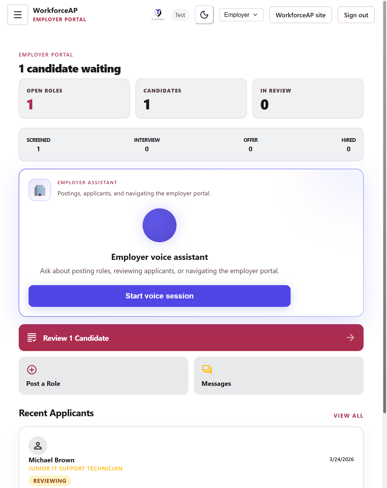

# Portal UI/UX — audit snapshots & enhancements

**Last updated:** 2026-04-08 · **Live host used for screenshots:** [workforceap-beta.vercel.app](https://workforceap-beta.vercel.app) (authenticated super-admin session in Cursor browser).

**Canonical path lists** (static + dynamic segments) live in [`scripts/lib/portal-audit-paths.mjs`](../scripts/lib/portal-audit-paths.mjs) — update that file when routes are added.

PNG files live in [`portal-screenshots/`](./portal-screenshots/) (viewport noted in filenames: `390` ≈ mobile, `1280` ≈ desktop). **Sub-page** captures and a running index: [`portal-screenshots/README.md`](./portal-screenshots/README.md). Automated browser width/resize may not match real device chrome; use these as **representative** references and re-capture after major layout changes.

---

## Screenshot index

### Employer (`/employer`)

| Viewport | File | Notes |
|----------|------|--------|
| ~390×844 | [`employer-mobile-390.png`](./portal-screenshots/employer-mobile-390.png) | KPI strip, collapsed/expandable employer assistant, primary CTA, recent applicants. |
| ~1280×800 | [`employer-desktop-1280.png`](./portal-screenshots/employer-desktop-1280.png) | Tour may appear on first visit; skip for a clear view of the hub. |

### Partner (`/partner`)

| Viewport | File | Notes |
|----------|------|--------|
| ~390×844 | [`partner-mobile-390.png`](./portal-screenshots/partner-mobile-390.png) | Partner hero, 2×2 KPIs, next-step card, assistant, recent members. |
| ~1280×800 | [`partner-desktop-1280.png`](./portal-screenshots/partner-desktop-1280.png) | Same route at wider width; compare with desktop “Partner overview” layout below `md`. |

### Counselor (`/counselor`)

| Viewport | File | Notes |
|----------|------|--------|
| ~390×844 | [`counselor-mobile-390.png`](./portal-screenshots/counselor-mobile-390.png) | Greeting, assistant row, stat grid, active roster / empty state. |
| ~1280×800 | [`counselor-desktop-1280.png`](./portal-screenshots/counselor-desktop-1280.png) | PageHeader + voice block + two-column content. |

### Inline preview (Employer mobile)

---

## Issues observed (this pass + prior audits)

| Area | Problem | Severity |
|------|---------|----------|
| **Heading hierarchy** | Parallel **mobile** and **desktop** trees can each expose an `h1`, so accessibility snapshots sometimes list **two** top-level titles on one URL (see [`PORTAL-UI-UX-AUDIT-FINDINGS.md`](./PORTAL-UI-UX-AUDIT-FINDINGS.md) **F-02**). **Mitigated on `/employer/jobs`** (single shared `PageHeader`); other sub-pages still on the one-shot plan. | P1 |
| **Partner mobile hero** | Org name as sole `h1` did not match desktop “Partner overview.” **Mitigated on hub** (`/partner`); sub-pages still need per-route checks. | P1 → fixed (hub) |
| **Counselor** | Redundant **sr-only `h1`** plus hero / `PageHeader`. **Mitigated on hub** (`/counselor`); sub-pages use separate patterns (see below). | P1 → fixed (hub) |
| **Employer mobile** | Hero was **`h2`** vs desktop **`h1`**. **Mitigated on hub** (`/employer`); other employer routes still use sr-only `h1` + `PageHeader` in places. | P2 → fixed (hub) |
| **Assistant rows** | “Partner assistant” / “Counselor assistant” before **`(tap to open)`** could run together without a space. **Fixed on hub** for partner + counselor. | P2 → fixed (hub) |
| **Voice + assistant** | Employer/partner/counselor combine **expandable assistant** and **full voice surface** (by breakpoint); can feel like duplicate “assistant” regions (**F-03**). | P2 |
| **Onboarding tour** | Employer tour overlays the hub on load; screenshots should skip the tour or use accounts with `tourCompletedAt` set. | P3 |
| **Visual polish** | Mixed emphasis on stat cards (e.g. red vs black numbers), large voice cards — track contrast (**WCAG**) on real displays. **Employer mobile applicants:** job title line toned to `on-surface-variant` (see shipped fixes). | P3 |

---

## Fixes shipped (code)

| Change | Files |
|--------|--------|
| **Employer `/employer/jobs`:** single shared **`PageHeader`** (one **`h1` “My Jobs”**); responsive subtitle + actions; removed duplicate mobile/desktop headers and extra **`wa-sr-only`** `h1`. | `app/(portal)/employer/jobs/page.tsx` |
| **`PageHeader` / `PortalPageFrame`:** **`subtitle`** accepts **`ReactNode`** for responsive one-line subtitles without duplicate headings. | `components/portal/PageHeader.tsx`, `components/portal/PortalPageFrame.tsx` |
| **Employer applicants (mobile):** job title on applicant cards uses **`on-surface-variant`** and restrained emphasis (was loud gold/uppercase). | `components/employer/MobileApplicationsClient.tsx` |
| **Counselor:** removed sr-only `h1`; mobile hero is a single **`<h1>`** (greeting + first name); **spacing** before `(tap to open)` on counselor assistant summary. | `app/(portal)/counselor/page.tsx` |
| **Employer:** mobile hero **`h2` → `h1`** so the primary headline matches the importance of the desktop `PageHeader` title. | `app/(portal)/employer/page.tsx` |
| **Partner:** mobile hero **`h1`** set to **“Partner overview”**; **org name** moved to a prominent line below; **spacing** before `(tap to open)` on partner assistant summary. | `app/(portal)/partner/page.tsx` |
| **Footer vs bottom nav** (prior session) | `css/main.css` |
| **Sidebar focus rings** (prior session) | `css/main.css` |

---

## Route coverage & sub-page notes

Screenshots in this doc cover **hubs only** (`/employer`, `/partner`, `/counselor`). Everything below is **inventory + code-review notes** so QA can prioritize sub-pages without re-scanning the tree.

### Employer (10 static + 2 dynamic)

| Path | Screenshot | Notes |
|------|------------|--------|
| `/employer` | Yes (mobile/desktop) | Hub: voice block + KPI + pipeline; heading fixes shipped. |
| `/employer/applications` | Yes — [`subpages-desktop/employer-applications.png`](./portal-screenshots/subpages-desktop/employer-applications.png) | Two `PageHeader` blocks (mobile vs desktop) — **still** duplicate-`h1` risk; mobile job-line polish shipped. |
| `/employer/guide` | Yes — [`subpages-desktop/employer-guide.png`](./portal-screenshots/subpages-desktop/employer-guide.png) | Marketing-style hero `h1`; OK. |
| `/employer/jobs` | Re-capture after deploy | **Shipped:** single shared `PageHeader` (see one-shot plan); replace PNG when refreshed. |
| `/employer/jobs/new` | No | Mobile strip `h1` + desktop `PageHeader` — same family as AI tools. |
| `/employer/jobs/import` | No | Renders via `ImportJobClient` (no `page.tsx` `PageHeader`); verify title/`h1` in client component. |
| `/employer/jobs/[id]` | Dynamic | `PageHeader` + job `h1`; validate single logical title. |
| `/employer/matches` | No | `wa-sr-only` `h1` + `PageHeader`. |
| `/employer/messages` | No | Split inbox: `wa-sr-only` `h1` + `PageHeader`; check footer vs bottom nav when scrolled. |
| `/employer/pipeline` | No | `wa-sr-only` `h1` + `PageHeader`. |
| `/employer/settings` | No | Typically single `PageHeader` — lower risk. |
| `/employer/work-queue` | No | `PageHeader` — lower risk. |
| `/employer/candidates/[studentId]` | Dynamic | Mobile `h1` (name) + desktop `PageHeader` — spot-check. |

### Partner (12 static + 2 dynamic)

| Path | Screenshot | Notes |
|------|------------|--------|
| `/partner` | Yes (mobile/desktop) | Hub hero aligned to “Partner overview”; org name demoted. |
| `/partner/attention` | No | `PageHeader` — check empty vs table states. |
| `/partner/exports` | No | `PageHeader`. |
| `/partner/guide` | No | Large inline `h1` — compare with employer guide pattern. |
| `/partner/members` | No | List + detail links; verify loading/empty. |
| `/partner/members/[id]` | Dynamic | Spot-check from list. |
| `/partner/messages` | No | Two `PageHeader` variants (mobile vs desktop layouts). |
| `/partner/milestones` | No | Two `PageHeader` blocks (responsive sections). |
| `/partner/outcomes` | No | `PageHeader` + charts; verify readability. |
| `/partner/referred-members` | No | Two `PageHeader` blocks + invite action. |
| `/partner/referred-members/[memberId]` | Dynamic | Detail layout. |
| `/partner/resources` | No | Two `PageHeader` blocks. |
| `/partner/settings` | No | `PageHeader`. |

### Counselor (5 static + 1 dynamic)

| Path | Screenshot | Notes |
|------|------------|--------|
| `/counselor` | Yes (mobile/desktop) | Hub: sr-only `h1` removed; mobile `h1` + desktop `PageHeader`. |
| `/counselor/guide` | No | Inline `h1` hero (like partner/employer guides). |
| `/counselor/messages` | No | Two `PageHeader` rows (mobile/desktop split). |
| `/counselor/resources` | No | Two `PageHeader` blocks. |
| `/counselor/students` | No | Two `PageHeader` blocks (same title repeated). |
| `/counselor/students/[memberId]` | Dynamic | Visible `h1` + `PageHeader` on desktop — **duplicate title pattern**; candidate for same treatment as job detail pages. |

### Member (`/dashboard/**`)

| Coverage | Notes |
|----------|--------|
| **Screenshots** | Prior session: `/dashboard`, `/dashboard/ai-tools` (see audit doc). Not re-shot in this pass. |
| **Per-route table** | Full inventory, finding codes (**H1**, **NAV**, **SH**, **TOK**), and automation commands are in [`MEMBER-PAGES-AUDIT.md`](./MEMBER-PAGES-AUDIT.md). |
| **AI tools sub-routes** | Many tools still use **`PageHeader` + second `h1`** in the hero strip (e.g. job-match-scorer, resume-rewriter, salary-negotiation, resume-analysis). Cover-letter and interview-practice were fixed earlier; **remaining files** follow the same sweep pattern. |
| **High-traffic follow-ups** | [`MEMBER-PAGES-AUDIT.md`](./MEMBER-PAGES-AUDIT.md) §3: `/dashboard/training`, `/dashboard/messages`, `/dashboard` duplicate heroes; `/dashboard/mentors` inline styles (**TOK**). |

### Admin (`/admin/**`)

| Coverage | Notes |
|----------|--------|
| **Screenshots** | `/admin` referenced in [`PORTAL-UI-UX-AUDIT-FINDINGS.md`](./PORTAL-UI-UX-AUDIT-FINDINGS.md); not expanded here. |
| **Static routes** | See `STATIC_PATHS.admin` in [`portal-audit-paths.mjs`](../scripts/lib/portal-audit-paths.mjs) (30+ paths). |
| **Dynamic** | Members, partners, jobs, blog, subgroups — open **one real row** from each list when QA’ing. |

### Dynamic segments (all portals)

Spot-check when data exists (from [`portal-audit-paths.mjs` `DYNAMIC_PATHS`](../scripts/lib/portal-audit-paths.mjs)):

| Area | Segments |
|------|----------|
| Member | `career-brief/[slug]`, `career-library/[id]`, `jobs/[id]`, `mentors/[mentorId]` |
| Admin | `blog/[id]/edit`, `blog/preview/[slug]`, `jobs/[id]`, `members/[id]`, `members/[id]/lifecycle`, `members/[id]/readiness`, `partners/[id]`, `subgroups/[id]`, `subgroups/[id]/edit` |
| Employer | `jobs/[id]`, `candidates/[studentId]` |
| Partner | `members/[id]`, `referred-members/[memberId]` |
| Counselor | `students/[memberId]` |

---

## Follow-up (not done here)

- **Single responsive column:** Long-term fix for **F-02** is one main column per route (or `aria-hidden` on the inactive breakpoint’s root) so the DOM never exposes two `h1`s — requires broader refactor than heading tweaks.
- **AI tools index:** Normalize card heights / grids (`/dashboard/ai-tools`).
- **Playwright:** `npm run audit:portal` with stored auth; archive results under `docs/` if desired.
- **Re-capture screenshots** on production after deploy so partner/counselor/employer hero copy matches this doc.

---

## Related docs

- **[`PORTAL-UI-ONE-SHOT-TASK.md`](./PORTAL-UI-ONE-SHOT-TASK.md)** — consolidated **sub-page visual + a11y audit**, execution plan, **shipped vs pending** rows, and screenshot acceptance criteria.
- [`PORTAL-UI-UX-AUDIT-FINDINGS.md`](./PORTAL-UI-UX-AUDIT-FINDINGS.md)
- [`CROSS-PORTAL-AUDIT-PLAN.md`](./CROSS-PORTAL-AUDIT-PLAN.md)
- [`MEMBER-PAGES-AUDIT.md`](./MEMBER-PAGES-AUDIT.md)
