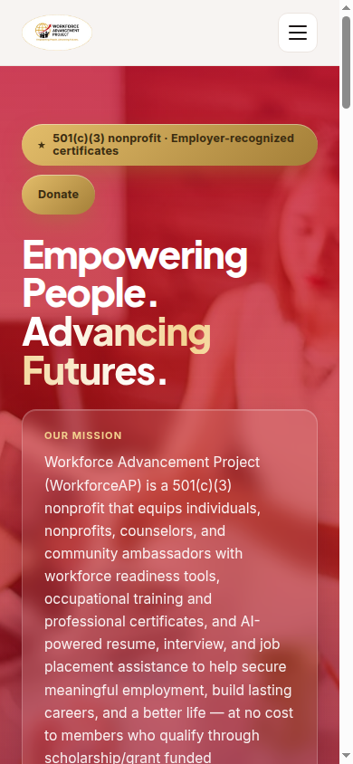
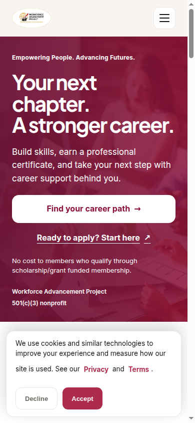
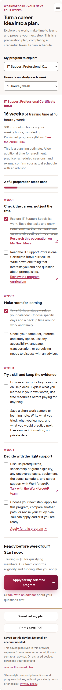
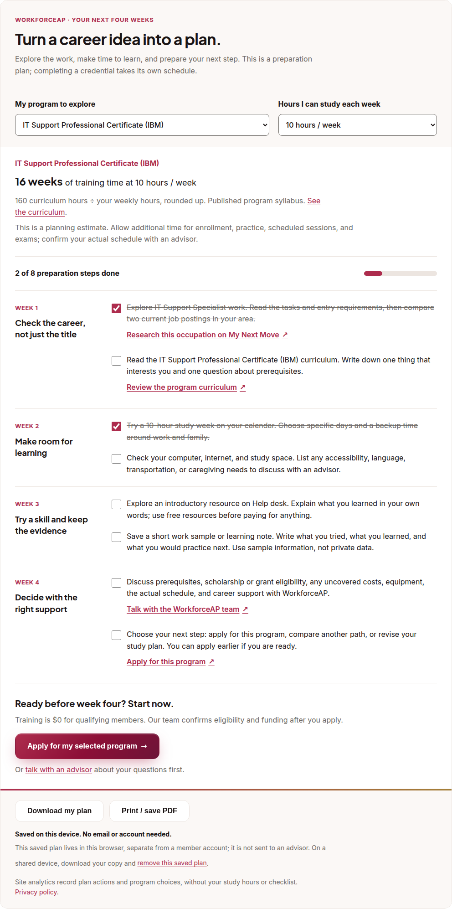
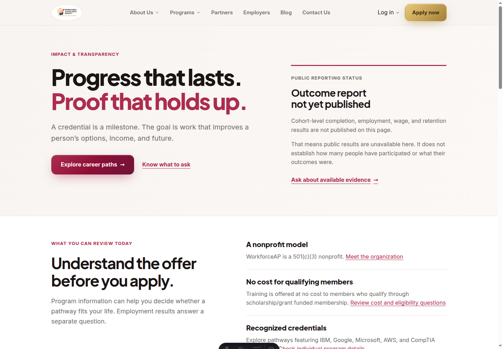

# Career discovery that leads to a useful next step

Built from production `a6327040` on 2026-09-08. The change improves the public Astro experience; authenticated portal behavior and production records are outside its scope.

## What a learner can now do

1. Find career exploration and application actions in the first mobile viewport.
2. Review actual program skills, curriculum hours, and published prerequisites.
3. Answer three questions and explore programs based on interests and readiness, without salary-based ranking.
4. Choose a program, set weekly study capacity, and follow an eight-task, four-week **preparation** plan. It is not a four-week credential or employment promise.
5. Keep separate progress for each recommended program, resume later on the same device, download a branded text copy, print/save PDF, or remove the saved plan.
6. Carry the chosen program into the application link.
7. Research occupational duties, preparation and wages through BLS, O*NET and My Next Move, with market data clearly separated from WorkforceAP outcomes.

## Before and after

At 390×844, the previous homepage placed application/pathfinder actions at approximately y926/y988. The new career-path action sits at y389–445 and application at y451–499, both above the first-visit consent banner. This measures visibility, not a conversion lift.

| Before | After |
| --- | --- |
|  |  |

The shared marketing layout now emits canonical URLs, Open Graph and Twitter metadata, and organization structured data. These support consistent identification and link previews; no search ranking or brand-growth result is claimed.

## Verification

- Astro production build: all 68 pages pass.
- Next.js production build: pass, including 498 generated static routes and production lint/type validation, using CI placeholder credentials.
- TypeScript: pass.
- ESLint: no errors; existing unrelated warnings remain. Changed TypeScript/React files have no warnings.
- Node unit lane: 1,435 passed, 0 failed, 8 explicit skips.
- Vitest: 253 files and 2,157 tests passed, including 15 focused plan/ranking tests. The existing homepage touch-target contract was updated for the new links.
- Browser: home, career research and impact reviewed at 375, 768 and 1440 widths; no horizontal overflow or runtime errors.
- Plan browser checks: real quiz, correct program handoff URL, verified-hour pacing, no estimate at zero capacity or unknown hours, separate checklists, reload/resume, downloaded text, print PDF, malformed/blocked storage, and removal without immediate re-saving.
- Search: `IT support` returns the three relevant programs; an unmatched query displays recovery; clearing restores 20. Multi-word token-prefix matching avoids matching `IT` inside `Literacy`.
- Rendered HTML: 29 key pages have one H1, one canonical and one set of social title/image metadata.
- No real applications, emails, donations, or member records were submitted during verification.

## Measurement added

The plan uses the existing marketing data layer with `funnel=career_plan` and milestones `opened`, `downloaded`, `print_requested`, and `preparation_completed`, plus the existing quiz/application click events. Payloads include program slug, not checklist answers, study hours, or contact details. `print_requested` records intent, not proof that a PDF was saved. Preparation completion is not training completion. Existing analytics consent configuration governs collection.

These events allow follow-up measurement of plan use and progression to application. Outcome improvement still requires actual enrollment, completion, credential, employment and retention evidence, with denominators and coverage stated.

## Publication and evidence limits

The new impact page explains what is publicly available without implying that unavailable reports mean zero participants or zero outcomes. No placement rates, wage gains, ratings, rankings or testimonials were invented. See [the evidence review](../../career-launch-evidence-2026-09-08.md) for source boundaries and the unresolved provenance of an existing seeded success story.

This is a functional and editorial upgrade. It does not establish that WorkforceAP is the best provider in America, independently verify all existing site content, or replace an outcome evaluation.
