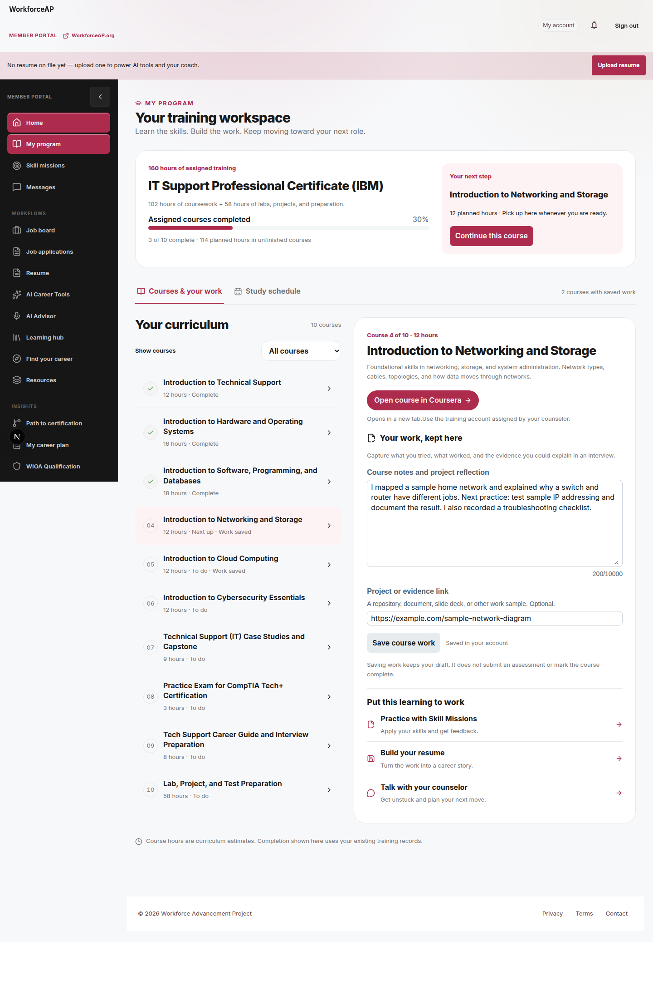
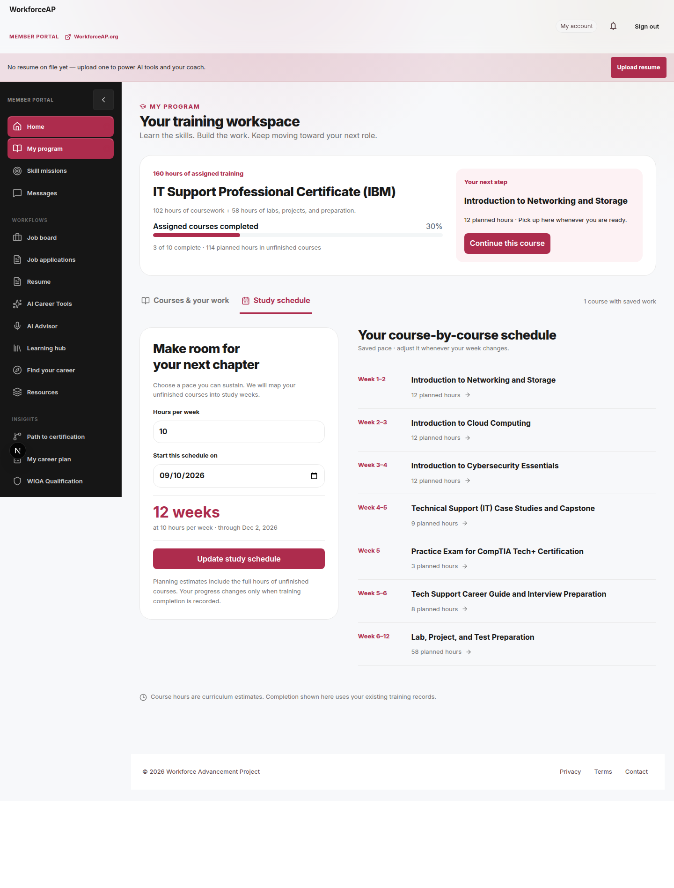
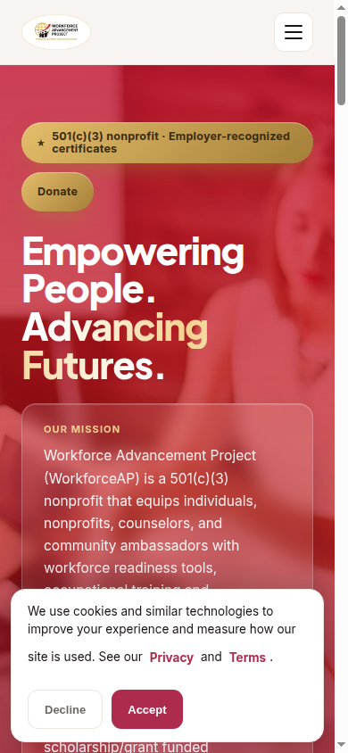
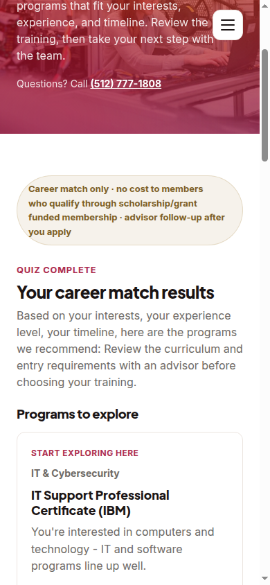

# Member training and informed program discovery

Working from production `a6327040`, September 8, 2026. The homepage is preserved
exactly as requested. Work centers on the enrolled member experience and on
accurate program information that leads into training.

## Member training workspace

The authenticated `/dashboard/program` now presents the member's assigned
curriculum as a working course outline. The IT Support assignment contains all
10 courses and 160 hours, including the 58-hour lab/project/preparation block.
Each course has a workspace with its description, a verified launch destination
when available, working notes, and a project/evidence link. Members can revisit
any assigned course and filter for unfinished courses or saved work.

A study-schedule view maps unfinished courses into weeks at the member's chosen
pace. The schedule, course notes, and evidence links persist in PostgreSQL under
the authenticated member, program, and immutable curriculum version. They are
separate from provider completion and credentials. Existing assignments are not
upgraded or replaced with a newer public syllabus. Where published and assigned
hours differ, the screen explains the difference. A public coursework/lab
breakdown is shown only when the actual assigned course names and hours match
the source syllabus, even when two different curricula share a 160-hour total.

Saving work never completes a course. The workspace's completion bar uses all
assigned courses as its denominator: the fixture's three completed courses are
30% of ten, including the applied lab. Course hours are planning estimates,
not attendance records. The existing provider launch and completion systems
remain responsible for actual training access and completion evidence.

### Validation

- Full Node test lane: 1,435 passed, eight existing skips.
- Full Vitest lane: 257 suites and 2,208 tests passed after correcting the
  packaging verifier. Final focused checks also cover three new regressions
  for matching the assigned curriculum to the published hour breakdown.
- Eleven actual-component tests cover course switching, draft persistence,
  save races, errors, filters, schedule validation, unsaved navigation, course
  destinations, and the full assigned-course completion denominator.
- Local authenticated API-to-PostgreSQL checks prove schedule/work persistence,
  second-member isolation, invalid-request rejection, and unchanged official
  completion and enrollment records. Authentication uses normal Supabase SSR
  cookies against a disposable local auth fixture; no bypass was added to the app.
- Optimized Next.js production build: 499 pages pass. Both production-mode
  saves and reloads, isolation, and invalid-request checks pass. Hosted Vercel
  checks confirm the restored homepage, program application handoff, and the
  new authenticated API boundary. See [runtime verification](training-verification.md).

### Release behavior

Two additive tables store study plans and course work. Their migration enables
row-level security with own-member policies. Normal production releases apply
the migration through the existing deployment process. The preview bootstrap
accepts only the configured DEMO database on Vercel Preview, checks the schema
before and after applying it, and refuses production targets or partial schema.
If workspace storage is unavailable, the existing course view remains available
with an explicit retry notice; failed saves never show success.

All validation used synthetic local members. No production member work was
changed and no production release was performed.

## Public journey

- `marketing/src/pages/index.astro` and its mobile touch-target test are
  byte-identical to `a63270406ae691b96a801989ba0d3f7f356fb53b`.
- The three-question pathfinder recommends real catalog programs using interest
  and readiness. Each result links to its curriculum and preserves its program
  slug in the application URL. Existing members can sign in to
  `/dashboard/program`.
- The downloadable/printable preparation plan and its local-storage feature
  have been removed. Public pages do not promise that feature.
- Catalog, comparison, salary research, and impact transparency improvements
  remain. Unsupported salary/demand figures are not used to rank or promote
  the corrected programs. Syllabus hours, tuition, and prerequisites remain.
- Shared canonical/social metadata remains; no ranking or brand-growth result
  is claimed.

## Current public evidence

`home-before-mobile.png` preserves the original production reference. The
redesigned homepage and preparation-plan artifacts are no longer part of the
review package.

## Verification after the scope correction

- Exact source-byte comparison confirms homepage and mobile test restoration.
- Astro production build: all 68 routes pass.
- Targeted Vitest: 2 suites, 4 tests pass (matching regressions and original
  homepage touch targets).
- Mobile quiz completed at 390 × 844: computer beginner results start with IBM
  IT Support and CompTIA A+; application URLs include the matching program
  slugs; member sign-in targets `/dashboard/program`; no preparation-plan or
  export controls remain. No page overflow or runtime errors observed.
- Earlier retained-page review verified catalog/detail/comparison hours and
  prerequisite integrity, salary-guide search/recovery, and impact-page
  navigation. See the linked source reviews for boundaries.
- No production deployment, live application submission, outbound message, or
  real member-record mutation was performed by the public-journey review.

See [the public journey audit](../2026-09-08-public-career-journey.md) and
[the evidence review](../../career-launch-evidence-2026-09-08.md). Neither
constitutes an independent outcome evaluation or proof of national ranking.
