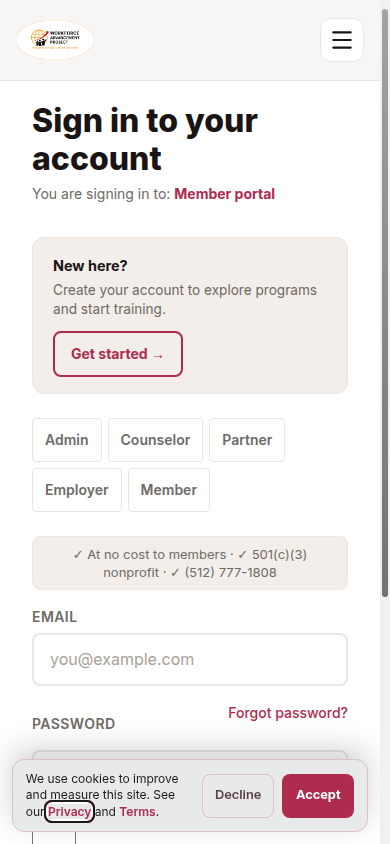
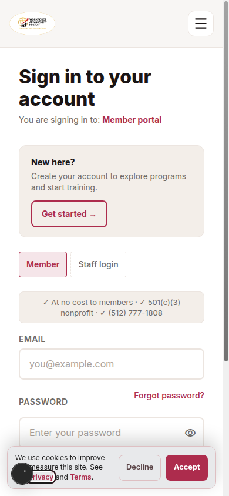
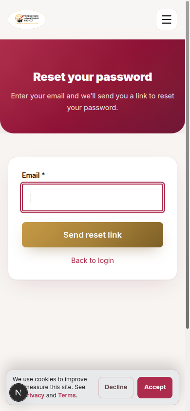
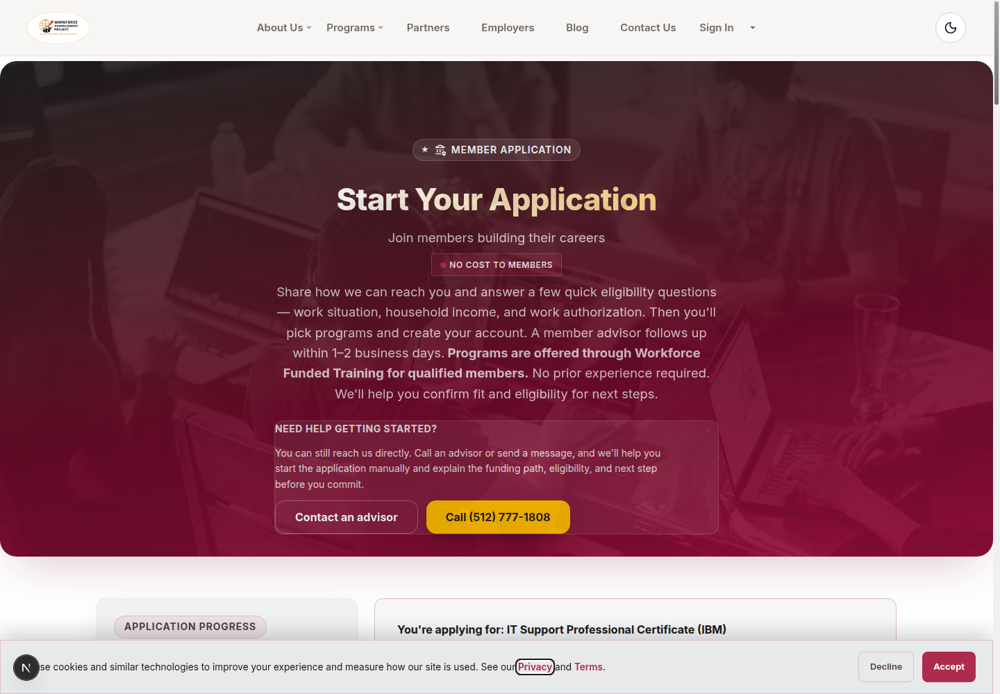

# Public-to-training journey and brand review

September 9, 2026. Reviewed the hosted PR preview and local Next.js app at
`127.0.0.1:4323`, plus the actual routing, recovery, program, and publication
sources. This review used no real applications, enrollment submissions, reset
emails, or private member records. It does not establish outcome accuracy or a
national ranking.

The father's homepage remains byte-identical to
`a63270406ae691b96a801989ba0d3f7f356fb53b:marketing/src/pages/index.astro`.
No homepage, public shared layout, or public global CSS was changed in this work.
The shared portal navigation and course workspace are owned by parallel reviews.

## Ranked findings

| Priority | Evidence and consequence | Resolution / next step |
| --- | --- | --- |
| High — fixed | Opening `/login?redirectTo=/dashboard/program` displayed Admin, Counselor, Partner, Employer, and Member choices with **none selected**. `LoginForm` compared the entire deep link with portal roots. Clicking Member also replaced the requested page with `/dashboard`. | Match the URL pathname to its portal, including nested and localized routes. Member training links keep staff choices collapsed; the active portal link and member signup link preserve the exact destination, including query and fragment. |
| High — fixed | “Forgot password” dropped `redirectTo`; the form, email request, retry link, and back links also dropped it. The mail helper appended `?token_hash` directly, which would corrupt a reset URL already containing a destination query. | Carry a normalized same-origin destination through the actual form, API, email, reset, retry, and back links. Build recovery-token parameters with `URLSearchParams`. Existing rate limits and uniform unknown-account responses remain. |
| High — partially fixed | Unsupported catalog salary bands reappeared on the next step: `ApplyProgramIntro` called `salaryRangeDisplay`; `/apply/results` and `ProgramPicker` rendered `program.salary`, including the confirmation state. This undermined the corrected public catalog. | Removed those rendered bands and the application helper's unused salary calculation. Provider, skills, title, duration, selection and funding flows remain. Added separate salary-research links. Older Next decision-journey pages and the legacy My Program branch still have salary consumers; migrate those remaining consumers before claiming sitewide consistency. Job-posted salaries and member-reported wages are separate evidence and should not be indiscriminately removed. |
| High — unresolved evidence | `marketing/src/data/blog.ts` and `prisma/seed-blog.ts` publish “Marcus's Story,” including quotations, a six-week hiring interval, and a 40% wage increase. The files provide no interview, consent, paired wage record, or reviewed testimonial reference. The impact page accurately says cohort results are not published there. | Locate the original evidence and publication consent, or have the content owner review publication status. Absence of provenance in these files does **not** prove fabrication. A dated cohort report with denominators, missingness, evidence sources, and reviewer ownership is the highest-value brand investment; a new badge is not a substitute. |
| Medium — fixed | Application metadata referenced `/images/og/apply.webp`, which is absent from the repository. A program-specific application shared the same missing image. | Both application variants now reference the existing full-resolution `/images/logo-tight.png`, with measured 1930 × 985 dimensions and meaningful brand alt text in Open Graph/Twitter metadata. The asset returns HTTP 200 `image/png`. No new logo or homepage design was introduced. |
| Medium — next design decision | At 390 × 844, the login form still places a large new-account promotion and credential strip above password/sign-in. Collapsing irrelevant staff choices removes a row, but the returning learner's submit control remains below the first viewport with first-visit consent visible. | Prioritize the returning learner's actual sign-in controls on explicit member deep links; retain a smaller account-creation route. Validate keyboard order, touch targets and first-visit consent together before adopting a layout change. This review leaves the larger composition unchanged. |

## Evidence

Hosted before: `/en/login?redirectTo=%2Fdashboard%2Fprogram` on the PR preview.
Local after uses the same destination.

The browser confirmed login → forgot-password → back-to-login and invalid-reset
→ request-new-link retain `/dashboard/program`. Login was checked at 375, 768,
and 1440 pixels with no document overflow and the Member destination selected.
The application retained the IBM IT Support program and its curriculum link.
Rendered social metadata points to the available PNG with its actual dimensions.
Additional viewport screenshots are in `/tmp/wap-journey-login-after-*`.

## Validation and boundaries

- Actual login/forgot/reset React components: eight tests cover member and staff
  deep links, locales/query/fragment preservation, recovery request and return
  links, expired-token retry, successful password update destination, and unsafe
  input. The transport and auth-provider boundaries are mocked.
- Actual recovery route and mail helper: ten tests cover token/query composition,
  malformed/external/login-loop destinations, both mail-provider paths, existing
  staff-issued reset links, and unknown-account response behavior. No email is sent.
- Existing auth-route and school-application regression suites remain green:
  four suites, 84 tests including the 18 new recovery tests.
- Two application metadata tests resolve the referenced asset from disk, check
  its real PNG dimensions and alt text, and retain program-specific canonical URLs.
- Focused ESLint and `git diff --check` pass. Combined typecheck, full test lanes,
  production build, and authenticated training checks are owned by the root review.
- No production deployment, merge, approval label, or external message was performed.

## Small next steps

1. Finish migrating the remaining unsupported catalog-salary consumers, with a
   named source owner and a rendered-page inventory. Keep actual job offers and
   documented member wages distinct from occupational estimates.
2. Review the mobile sign-in hierarchy specifically for an existing member's
   course deep link; the homepage does not need to change for this improvement.
3. Inventory the existing quiz, application, approval and course-launch events
   before defining conversion reporting. Measure verified training starts and
   returning learners, not only page views or account creation. No conversion
   uplift has been measured by this code review.

The larger platform opportunity is to make practice, reviewable work, and human
feedback accessible from each assigned course. Parallel work is addressing that
path; these auth fixes ensure learners can actually return to it. Completion
evidence and learner notes must continue to represent different things.
