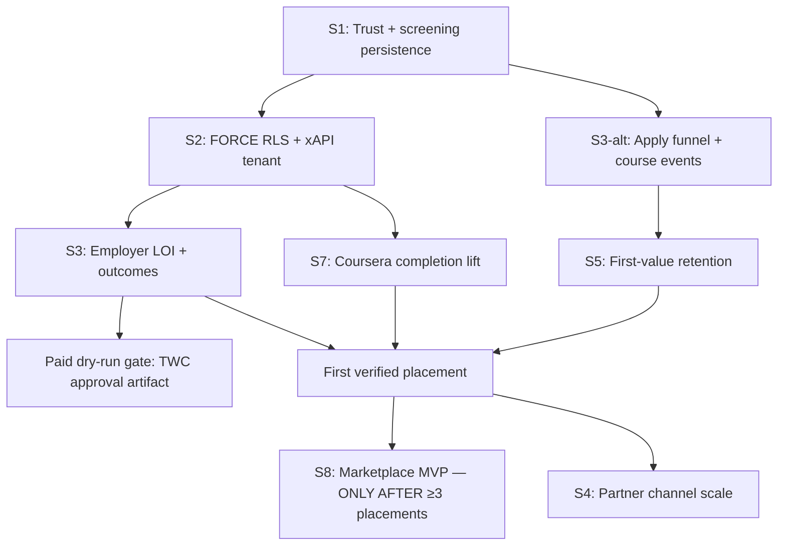

# WorkforceAP — Adversarial CEO Review: 10-Sprint Plan

**Date:** 2026-05-21  
**Reviewer lens:** YC-style adversarial CEO (will this company survive and win, or are we decorating a runway?)  
**Subject:** `docs/PLAN-2026-Q3-Q4-10-SPRINT.md` on `plan/2026-q3-q4-10-sprint`  
**Baseline:** `master` @ `fe481b7fd`  
**North star under test:** Paid employer placements per 100 enrolled members in the Google IT Support cohort, Central Texas

---

## Executive read (60 seconds)

This plan is **materially better than the 16-plan sprawl it replaces**: one north star, explicit bear case, shipped-vs-open appendix, and honest parking lot. The team clearly read the CEO strategic review and incorporated it.

The fatal flaw is **sequence schizophrenia**. Sprint 1 opens a paid-traffic dry-run while Sprint 3 flips FORCE RLS and closes xAPI tenant gaps. Sprint 8 builds a marketplace MVP while Sprint 10's success metric is "≥5 verified placements" — meaning you won't know if the machine works until *after* you build the moat. Sprint 4 chases partner signups before you've proven a single paid placement.

You're not wrong on *what* to build. You're wrong on **when**, and you haven't decided **who pays you** before spending 20 weeks building.

**Verdict:** Ship S1 trust fixes and S2 employer LOI motion immediately. **Pull FORCE RLS forward.** **Defer R4 marketplace to Q1 2027.** **Decide monetization spine this week** or every sprint optimizes a different company.

---

## 1. Will this 10-sprint plan ship what matters?

Per-sprint assessment: is the goal the highest-leverage thing, or busywork?

| Sprint | Theme | Verdict | Rationale |
|--------|-------|---------|-----------|
| **S1** | G1 funnel close + paid dry-run | ⚠️ | Trust-claim binding and WIOA screening persistence are **existential** — correct. But "paid-traffic dry-run" in the same sprint as open xAPI tenant gaps and deferred FORCE RLS is **playing with fire**; dry-run should mean organic/referral only until S3 (or collapsed S3 into S1). |
| **S2** | G3 employer activation + outcomes | ✅ | Highest-leverage revenue motion: LOI + defensible outcomes dashboard. Fixes `hasCompletedInterviewPractice` blind spot. This is how you get paid. |
| **S3** | FORCE RLS + multi-tenancy | ✅ | **#0 audit item.** Non-negotiable before multi-board tenants or scaled traffic. Goal is correct; **calendar slot is wrong** (see §2). |
| **S4** | G4 partners + WIOA-board kit | ⚠️ | Board kit and real `/partners` stats are good **if** S1–S2 delivered screening volume proof. Partner CSV upload + analytics before first placement is **channel expansion before product-market fit** — classic nonprofit scope creep. |
| **S5** | R1 first-value + R2 finalize | ✅ | Day-7 retention and coach memory polish directly attack the churn cliff. Builds on shipped R2 — smart sequencing *within* retention track. |
| **S6** | G5 mobile + G6 SEO | ⚠️ | Single-program landing page is **CEO wedge recommendation** and should be **S1**, not S6 — paid traffic hitting multi-sector homepage for 10 weeks destroys CPA. Mobile parity matters but SEO/blog posts are **Q4 nice-to-have** vs. closing enrollments now. |
| **S7** | R3 Coursera completion engine | ✅ | The difference between "lead-gen site" and "workforce provider." Completion lift → placement lift. Correct priority; should start earlier if ads run before August. |
| **S8** | R4 marketplace MVP | ❌ | Smart Candidate Slate with **zero placements proven** is building supply-side marketplace before demand exists. Employer shortlist without verified hire loop = demo-ware. Defer until ≥3 placements recorded. |
| **S9** | P5 perf + P6 resilience | ⚠️ | Necessary before 10× traffic — but **premature if ads don't scale until Q4 anyway**. Do a lightweight pass in S3 rehearsal; full sprint only if approval lands before S9. |
| **S10** | Q4 close + 2027 plan | ✅ | Retention funnel dashboard and funder export package are what boards buy. Bug burndown is honest. **Monetization spine decision belongs in S1**, not S10. |

**Score:** 4 ✅ · 4 ⚠️ · 1 ❌ — plan identifies the right work but mis-orders ~40% of it.

---

## 2. Sequence challenges

### 2.1 Is FORCE RLS in S3 too late if paid traffic starts in S1?

**Yes. This is the plan's single biggest sequencing bug.**

S1 explicitly targets a **paid-traffic dry-run** ($0–500/day) contingent on trust-claim fixes and an ops gate — but S3 (2026-06-18 → 2026-07-01) is when FORCE RLS flips, xAPI `organization_id NOT NULL` lands, and layout GUC passes real `orgId`.

Between S1 and S3 you will have:
- Paid or semi-paid applicants creating accounts under **Prisma service-role bypass** of RLS
- xAPI events with **nullable `organization_id`** crediting completions to wrong org
- Admin routes with **partial** tenant scoping (`a8204dc89` fixed admin views; ingest path still open)

The plan's own bear case (§0) cites cross-tenant xAPI and FORCE RLS as **90-day kill scenarios**. Running *any* paid traffic before S3 complete is inconsistent with that bear case, even at $500/day.

**Recommended re-order:**

```
S1 (unchanged goal, tightened scope):
  ├── Trust claims dynamic/suppressed
  ├── WIOA screening DB persistence
  ├── Apply funnel P0s
  └── NO paid traffic — organic/referral/waitlist only

S2 (split current S1+S3 critical path):
  ├── FORCE RLS staging rehearsal → prod flip
  ├── xAPI organization_id NOT NULL + backfill
  ├── Layout GUC orgId fix
  └── verify-high-risk-tenant-routes expanded

S3 (current S2):
  ├── Employer LOI motion + outcomes dashboard
  └── hasCompletedInterviewPractice real signal

S4+: resume current S4–S7 sequence with paid dry-run unlocked AFTER S2
```

**Dependency map (critical path to first paid placement):**



### 2.2 Is R4 marketplace (S8) too early before S5 first-value?

**Partially — the sprint number misleads.**

R4 is scheduled **after** S5 (first-value), so the literal question is wrong. The real question: **Is R4 too early before first *placement*, not first *value*?**

**Yes.** S5 improves Day-7 retention and coach engagement. S8 builds employer shortlist → member prep loops. But S10's success metric is **≥5 verified placements** — meaning the plan assumes you won't *know* if placements work until **after** you've built the marketplace.

Marketplace MVP without:
- ≥1 employer LOI converted to active job post (S2 target)
- ≥1 verified `PlacementRecord` with attribution
- Counselor workflow for shortlist → interview → hire

…is a **feature demo**, not a moat. Employers won't shortlist candidates from a platform with zero proven hires.

**Recommendation:** Move R4 to **2027-Q1** (per S10's own `PLAN-2027-Q1.md` draft). Replace S8 with **"Placement loop close"** — counselor hire verification UI, placement dispute workflow, Stripe pipeline subscription billing (not contingent fee), and first 3 placement case studies.

### 2.3 Other sequence flags

| Issue | Current | Fix |
|-------|---------|-----|
| Single-program landing (`/programs/google-it-support`) | S6 | **S1** — every day of paid traffic to multi-sector homepage burns CAC |
| `course_launched` / milestone events | S1 | Keep in S1 — feeds S5/S7; don't cut (see §3 for S1 cuts that are safe) |
| Partner CSV bulk import | S4 | Requires S2 FORCE RLS — correct dependency, but **defer S4 to post-first-placement** |
| Perf/resilience (S9) | Before Q4 ad scale | Acceptable **if** ads gated; otherwise move perf pass to immediately pre-scale |

---

## 3. Scope creep risks

Sprints with **>6 tickets:** S1 (7), S2 (7). All others = 6 or fewer.

### Sprint 1 — 7 tickets → cut these 2 first

1. **Merge open PR #1390 mobile launch chrome; verify TrustStrip on `/` + `/apply`** — cosmetic polish; TrustStrip correctness matters, mobile chrome doesn't block paid gate. **Cut or defer to S6.**

2. **Wire `course_launched` + progress milestones (25/50/75/100%)** — important for S5/S7 but **not blocking S1 trust gate or dry-run**. Move to S5 opener; S1 has enough eng load with trust claims + screening + apply P0s.

*Keep:* trust claim binding, WIOA screening persistence, apply funnel P0s, ad copy rewrite, ops spend gate.

### Sprint 2 — 7 tickets → cut these 2 first

1. **Dashboard `dashboard_primary_cta_clicked` events** — telemetry hygiene, not revenue. R1 needs it eventually but **LOI + outcomes dashboard + interview signal** win if eng slips.

2. **2 Texas employer case studies on `/employers`** — content bottleneck; sales can use PDF one-pagers for LOI calls. Ship **1** case study max; cut the second.

*Keep:* Stripe pipeline hero CTA, `/admin/outcomes`, employer A/B winner, LOI sales motion, `hasCompletedInterviewPractice`.

---

## 4. Missing things

What is **NOT** in the plan that **should** be:

### Operations & reliability

| Gap | Why it matters | Suggested sprint |
|-----|----------------|------------------|
| **On-call rotation + escalation matrix** | Paid traffic + Coursera/Stripe/Anthropic dependencies = 3am pages. Plan has P6 resilience but no **human** on-call. | S2 (before any traffic) |
| **Incident response runbook** (data leak, ad claim incident, vendor outage) | Bear case §0 assumes compliance tripwire; no playbook for **when** (not if) it fires. | S2 |
| **Counselor capacity model** | Success metric "counselor time per placement <4h" in S10 — no hiring plan, no load forecast vs. enrollment targets. | S1 (model) → S4 (hire trigger) |

### Revenue & legal

| Gap | Why it matters | Suggested sprint |
|-----|----------------|------------------|
| **Refund / eligibility dispute flow** | WIOA members enroll expecting no-cost; approval slip + ineligible applicant = chargeback/reputation risk. | S1 |
| **Placement verification + dispute workflow** | Contingent $2,500 fee (still on site) requires proof-of-hire; no counselor/admin dispute UI in plan. | S3 (with employer LOI) |
| **Monetization spine decision** | Open question #1 in plan — **cannot wait until S10**. Every sprint optimizes different buyer. | **This week** |

### Compliance & trust

| Gap | Why it matters | Suggested sprint |
|-----|----------------|------------------|
| **GDPR/CCPA compliance for paid leads** | Paid apply captures PII + UTM; sub-processors listed (G8 shipped) but **no consent granularity, deletion workflow, or lead retention policy** for ad-sourced applicants. | S1 |
| **Content moderation for member-uploaded materials** | Resume upload, profile photos, AI coach inputs — no moderation queue, no ToS enforcement path, no CSAM/PII scan. Employer shortlist (S8) amplifies misrepresentation risk. | S5 |
| **Candidate misrepresentation liability** | Employer partner sues over bad hire → need attestation flow, skills verification tie to xAPI (not self-reported), terms indemnifying platform. | S3 |

### Customer experience

| Gap | Why it matters | Suggested sprint |
|-----|----------------|------------------|
| **Customer support tooling** | No Zendesk/Intercom/helpdesk sprint; counselors aren't a ticket system. Paid traffic → support volume step-change. | S2 |
| **Member eligibility verification workflow** | Screening persistence (S1) is step 1; **who approves WIOA eligibility** and how member sees status is unspecified. | S1 |
| **Ad spend kill switch (automated)** | Ops "written gate" (S1) is manual; need **API flag** that pauses campaigns if approval revoked or CPA > threshold. | S2 |

### Cross-cutting (plan mentions compliance track but doesn't ticket)

- **ETPL listing timeline** — referenced in S4 sales kit but no eng/ops ticket for listing maintenance
- **Audit trail completion** — `p1-audit-wireins-todo.md` spread across S3–S9 with no owner or burndown chart
- **Key-person risk on WIOA relationships** — CEO review flagged; no succession/partner signatory plan

---

## 5. Bear-case stress test

**Worst-case scenario selected:** **Paid CAC blows up + Texas WIOA approval slips 90 days + one employer partner alleges candidate misrepresentation on a shortlist.**

This combines the plan's top three bear-case threads into a single Q3–Q4 nightmare: you're spending, you're non-compliant, and your only revenue motion (employer pipeline) becomes a legal liability.

### Timeline of failure

| Week | Event | Plan assumption broken |
|------|-------|------------------------|
| S1 | Team runs $300/day dry-run; approval still "2 weeks out" | Ops gate erodes under board pressure |
| S1+2 | Journalist compares "850+ placed" ad archive to `/admin/outcomes` (even if live copy fixed, **Google caches ads**) | Trust gate incomplete — need ad takedown + archive audit, not just dynamic copy |
| S3 | FORCE RLS flip breaks admin path in prod; hotfix bypasses RLS "temporarily" | S3 rehearsal treated as checkbox, not production gate |
| S4 | Partner uploads 200 referrals; 40% ineligible; counselors at 2× capacity | No capacity model; partner channel amplifies bad leads |
| S8 | Employer shortlists 5 candidates; 1 hired; skills don't match; threat of lawsuit | No attestation, no moderation, marketplace built before verification loop |
| S10 | Retrospective: 0 verified placements, $18K ad spend, approval still pending | Entire plan optimizes inputs; north star metric never moved |

### Which sprints survive?

| Sprint | Survives? | Notes |
|--------|-----------|-------|
| S1 trust + screening | **YES — accelerate** | Only sprint that prevents the cascade. Strip paid dry-run; add GDPR/refund/dispute. |
| S2 employer LOI | **YES — but reprioritize** | Pause LOI outbound until compliance green; use time for support tooling + kill switch. |
| S3 FORCE RLS | **YES — pull forward to S2** | Becomes **the** sprint that determines survival. Everything else pauses. |
| S4 partners | **NO — freeze** | Partner referrals multiply bad leads when approval slips. |
| S5 first-value | **PARTIAL** | Retention work continues on **existing** members only; no new acquisition. |
| S6 mobile/SEO | **NO — defer** | SEO is irrelevant if you're not spending on ads. |
| S7 Coursera completion | **YES — critical** | Existing enrolled members are your only asset; completion lift is survival. |
| S8 marketplace | **NO — kill** | Misrepresentation lawsuit scenario **starts here**. Do not build. |
| S9 perf | **PARTIAL** | Only dashboard/counselor queue perf, not marketing bundles. |
| S10 retention measurement | **YES — reframe** | Becomes "salvage dashboard" — prove value to existing cohort for board renewal, not growth. |

### Re-prioritization under bear case

**New 10-sprint arc (survival mode):**

1. **S1′:** Trust + screening + eligibility workflow + ad **freeze** (not dry-run)
2. **S2′:** FORCE RLS + xAPI tenant + incident runbook + on-call
3. **S3′:** Coursera completion engine (pull S7 forward)
4. **S4′:** First-value retention on enrolled cohort only (current S5)
5. **S5′:** Employer LOI with **zero shortlist** — pipeline subscription only, manual placement records
6. **S6′–S10′:** Hold growth sprints; iterate on placement loop until ≥3 verified hires

**Cash preservation rule:** No sprint gets "success metrics" that require ad spend until **TWC approval artifact** is in `docs/compliance/` and signed by counsel.

---

## 6. Top 3 plan edits Mike should make TODAY

### Edit 1: Split S1 — kill paid dry-run until FORCE RLS ships (move S3 block to S2)

**Action:** Rewrite S1 success metric from "apply step-1→account ≥45% on paid traffic" to "apply step-1→account ≥45% on **organic/referral**; **$0 paid** until S2 FORCE RLS checklist signed."

**Why today:** The sibling CEO review and this plan agree cross-tenant leakage is a 90-day kill scenario. S1's paid dry-run contradicts S3's remediation. Every day of delay on RLS with live accounts adds backfill debt.

**Concrete diff:** Move these tickets from S3 → new S2 (insert before employer sprint):
- xAPI `organization_id NOT NULL`
- Layout GUC orgId
- FORCE RLS staging → prod flip
- `verify-high-risk-tenant-routes.cjs` expansion

Bump current S2–S10 → S3–S11 or compress partner/marketplace sprints.

---

### Edit 2: Decide monetization spine in writing — board SaaS primary, employer pipeline secondary

**Action:** Answer open question #1 **today** with a one-paragraph decision memo in the plan §0:

> "Primary revenue 2026–2027: WIOA board outcomes terminal at $2–5K/mo. Secondary: employer annual pipeline subscription (Stripe, already wired). Contingent placement fee demoted to footnote on `/employers` by end of S3."

**Why today:** S2 builds Stripe pipeline hero CTA; S4 builds partner funnel; S8 builds marketplace; S10 drafts 2027 plan — **four sprints, four buyers**. The homepage still dual-pitches (`lib/marketing/employerLanding.ts`). Pick one spine or every demo confuses the funder, employer, and partner in the same meeting.

**Concrete diff:** Add S3 ticket: "Rewrite `/employers` hero — pipeline subscription only; move $2,500 contingent to FAQ." Remove contingent fee from all ad copy and sales decks.

---

### Edit 3: Defer R4 marketplace (S8) → replace with "Placement loop close"

**Action:** Delete S8 marketplace MVP. Replace with:

**S8 — Placement loop close (2026-08-27 → 2026-09-09)**
- Counselor placement verification UI + dispute notes
- Member skills attestation tied to xAPI completion (not self-report)
- First 3 placement case studies with employer quote
- Stripe pipeline subscription checkout on `/employers` (self-serve)
- **Gate:** ≥1 LOI signed (S3) before sprint starts; else sprint slips

**Why today:** Building Smart Candidate Slate before ≥3 verified placements is **theater**. The CEO strategic review already flagged R4 as "zero code" — the 10-sprint plan schedules 19 eng-days for marketplace anyway. That capacity closes the hire loop and generates the case studies S6 SEO and S4 partner kit actually need.

**Move R4 marketplace to `PLAN-2027-Q1.md`** with explicit gate: "≥10 verified placements + ≥2 paying pipeline subscribers."

---

## Appendix — Quick reference

| Metric | Plan target | CEO review confidence |
|--------|-------------|----------------------|
| Placements by S10 | ≥5 verified | **Low** — marketplace before placement loop, partner channel before proof |
| CPA | <$25 enrolled | **Medium** — depends on S6 landing page arriving 9 weeks late |
| FORCE RLS | S3 | **High risk** — must be S2 or earlier |
| Employer LOIs | ≥1 by S2 | **High** — correct priority |
| Day-7 retention | +10pp S5 | **Medium** — good goal if acquisition paused appropriately |

---

*Review author: adversarial CEO pass · Branch: `review/ceo-on-10-sprint` · Plan reviewed: `plan/2026-q3-q4-10-sprint` @ `28cbb0de1`*
